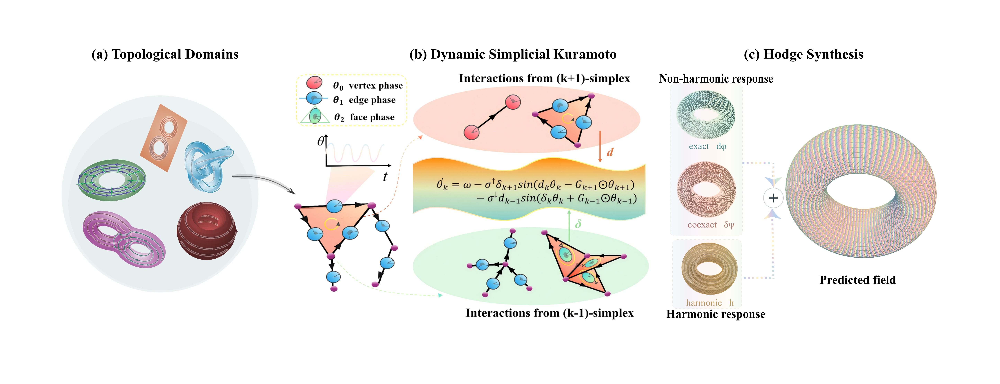

# Dynamic Kuramoto--Hodge Operators

This repository contains the implementations, data-generation utilities,
evaluation scripts, and baseline models used to study condition-adaptive
neural operators on discrete differential forms. The code supports three
problems:

| Problem | Discrete targets |
| --- | --- |
| Perforated Darcy flow | $C^0$ potential, $C^1$ flux, $C^2$ circulation |
| Toroidal transport | $C^0$ concentration, $C^1$ transport flux, $C^2$ face mass |
| Cavity magnetostatics | Flux-like $C^2$ response |

The model uses rank-aware representations on simplicial complexes, coupling
between adjacent ranks, and a Hodge-structured readout. The learned phase is
an internal relation state and is not a physical phase observable.



## Installation

The code was checked with Python 3.11.13 and PyTorch. Install the runtime
dependencies from the repository root:

```powershell
python -m venv .venv
.venv\Scripts\Activate.ps1
python -m pip install --upgrade pip
python -m pip install -r requirements.txt
```

Gmsh is required only for regenerating Darcy data. PyVista is used by the
geometry generators and visualization scripts.

## Data Generation and Paths

All benchmark datasets have corresponding generation code in this repository.
Generated datasets, checkpoints, reports, and figures use the following
task-local paths:

| Dataset | Output path |
| --- | --- |
| Darcy dataset | `experiments/darcy/data/perforated_darcy_v1.npz` |
| Toroidal transport dataset | `experiments/toroidal_transport/data/torus_transport_v1.pkl` |
| Toroidal cochain data | `experiments/toroidal_transport/cochains/data/torus_multiform_v1/` |
| Magnetostatics dataset | `experiments/magnetostatics/data/cavity_magnetostatics_v1.pkl` |

Training writes checkpoints and run records below these directories:

```text
experiments/darcy/runs/
experiments/toroidal_transport/runs/
experiments/magnetostatics/runs/
```

The paths are part of the public I/O contract. They should be preserved when
moving generated data or resuming an experiment.


## Workflow

The repository follows a common three-stage workflow:

1. **Generate data.** Each benchmark provides a data generator and writes its
	canonical dataset to the path listed in [Data Generation and Paths](#data-generation-and-paths).
2. **Train models.** DKHO, baseline, feature-control, and structural-ablation
	trainers write checkpoints and run records below the corresponding `runs/`
	directory.
3. **Evaluate and visualize.** Evaluation scripts read saved predictions and
	write metrics and figures below the corresponding `reports/` directory.

All commands below are run from the repository root. Each executable accepts
`--help` for its complete argument contract.

## Reproduction

### Evaluation

```powershell
# Darcy flow
python experiments/darcy/evaluate.py
python experiments/darcy/visualize.py

# Toroidal transport
python experiments/toroidal_transport/evaluate.py --tdk-output small/form_0
python experiments/toroidal_transport/evaluate.py --tdk-output large/form_0
python experiments/toroidal_transport/cochains/evaluate.py --tasks 1,2
python experiments/toroidal_transport/visualize.py

# Cavity magnetostatics
python experiments/magnetostatics/evaluate.py --recompute
python experiments/magnetostatics/visualize.py --sample best

# Phase--PDE diagnostic
python experiments/phase_analysis/analyze.py --device auto
```

Evaluation writes derived reports and figures below the corresponding
experiment directory.

### Data Generation

The data-generation modules are available under the corresponding experiment
directories. Toroidal cochain data can be derived from the released
toroidal transport dataset:

```powershell
python experiments/toroidal_transport/generate_data.py --output experiments/toroidal_transport/data/torus_transport_v1.pkl --overwrite
python experiments/toroidal_transport/cochains/generate_cochain_data.py
python experiments/toroidal_transport/cochains/validate_data.py
```

For Darcy, generate the mesh before generating samples:

```powershell
python experiments/darcy/dataset/mesh_darcy_holes.py --resolution main --overwrite
python experiments/darcy/dataset/generate_darcy_holes.py --resolution main --overwrite
```

Generate the magnetostatics dataset with:

```powershell
python experiments/magnetostatics/generate_data.py --output experiments/magnetostatics/data/cavity_magnetostatics_v1.pkl --overwrite
```

Each generator requires `--overwrite` before replacing an existing dataset;
use `--help` to inspect its sampling and output options.

### Training

The main training entry points are:

```text
experiments/darcy/dkho/train.py
experiments/darcy/baselines/train.py
experiments/toroidal_transport/train.py
experiments/toroidal_transport/baselines/train.py
experiments/toroidal_transport/cochains/train_dkho.py
experiments/toroidal_transport/cochains/train_baselines.py
experiments/magnetostatics/train.py
experiments/magnetostatics/baselines/train.py
experiments/feature_controls/train.py
```

Use `--help` for the supported task, profile, capacity, output, and training
options. Training and evaluation write outputs below `runs/` and `reports/`.

### Feature Controls

Feature controls test whether the performance difference is explained by the
information supplied to a model rather than by the baseline architecture. Each
baseline is evaluated with the same data split, target support, loss, and
optimization protocol while condition descriptors are added progressively.

| Benchmark | Input progression |
| --- | --- |
| Darcy | `native` -> `spectral` -> `diffusion_spectral` -> `conditioned` |
| Toroidal $C^0$ | `native` -> `flow` -> `flow_diffusion` -> `flow_diffusion_spectral` -> `flow_global_spectral` -> `conditioned` |
| Magnetostatics | `native` -> `boundary` -> `boundary_spectral` -> `boundary_diffusion_spectral` -> `conditioned` |
| Toroidal $C^1/C^2$ | `native` -> `spectral` -> `diffusion_spectral` -> `conditioned` |

The shared dispatcher covers the scalar toroidal and magnetostatics controls;
the Darcy command delegates to the rank-aware baseline trainer:

```powershell
python experiments/feature_controls/train.py --task toroidal_transport --model GNO --features velocity,heat,lpe,global,torus_fourier --epochs 200
python experiments/feature_controls/train.py --task magnetostatics --model GNO --features boundary,lpe,heat,qp --epochs 200
python experiments/feature_controls/train.py --task darcy --model GNO --rank all --profile all --epochs 200
```

For toroidal cochain targets, use
`experiments/toroidal_transport/cochains/train_baselines.py`. Darcy feature
control results are summarized by:

```powershell
python experiments/darcy/evaluate_feature_controls.py --profiles native,conditioned --require-complete
```

### Structural Ablations

Structural ablations isolate the contribution of the model components while
keeping the task, data split, and condition protocol fixed:

| Variant | Removed component |
| --- | --- |
| `full` | Complete model |
| `no_dirac` | Cross-rank Dirac coupling |
| `no_phase` | Phase dynamics |
| `no_harmonic` | Harmonic readout, when defined for the target rank |

The variants are supported by the Darcy, toroidal, toroidal-cochain, and
magnetostatics trainers through `--variants`. For example:

```powershell
python experiments/darcy/dkho/train.py --task 1 --configs conditioned --variants full,no_dirac,no_phase,no_harmonic --epochs 200
python experiments/toroidal_transport/train.py --capacity small --configs conditioned --variants full,no_dirac,no_phase,no_harmonic --epochs 200
python experiments/toroidal_transport/cochains/train_dkho.py --task 1 --configs conditioned --variants full,no_dirac,no_phase,no_harmonic --epochs 200 --output experiments/toroidal_transport/runs/dkho/small
python experiments/magnetostatics/train.py --configs conditioned --variants full,no_dirac,no_phase,no_harmonic --epochs 200 --output experiments/magnetostatics/runs/dkho/small
```

Use the corresponding ablation evaluators to compare saved runs:

```powershell
python experiments/toroidal_transport/evaluate_ablations.py
python experiments/magnetostatics/evaluate_ablations.py
```

For Darcy, the standard evaluator reads the saved structural variants.
The `no_harmonic` variant is defined only when the target has an explicit
harmonic readout.

### Phase--PDE Alignment Analysis

This analysis examines whether the learned cross-rank phase corrections are
spatially associated with meaningful PDE structure in the predicted solution.
It replays frozen model checkpoints without retraining and evaluates
rank-matched phase support, PDE support, their overlap, and enrichment. The
analysis covers Darcy $C^2$, toroidal transport $C^1$, and cavity
magnetostatics.

The phase shown by this analysis is an internal coordination state. It is not
interpreted as a physical phase field. Run the analysis with:

```powershell
python experiments/phase_analysis/analyze.py --device auto
```

The script writes the alignment report and triptych figure to
`experiments/phase_analysis/reports/phase_analysis/`.

## Repository Structure

```text
assets/figures/                  Curated figures used by this README
experiments/darcy/               Darcy models, baselines, and evaluation
experiments/toroidal_transport/  Toroidal models, baselines, and evaluation
experiments/magnetostatics/      Magnetostatics models, baselines, and evaluation
experiments/feature_controls/    Matched-input baseline controls
experiments/phase_analysis/      Phase--PDE alignment analysis
requirements.txt                 Runtime dependencies
```

